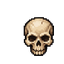

# Difficulty skull icons

Approved first column: A1 Normal, B1 Nightmare, C1 Hell.

Transparent RGBA PNGs at 32, 48, 64 and 128 pixels. Use 64px files for 32px CSS display on high-density screens. Each square canvas reserves roughly 12.5% padding; skull proportions are preserved. Source-resolution transparent crops are also included.

difficulty-skulls-atlas-64.png contains Normal, Nightmare, Hell left to right in three 64px cells. difficulty-skulls.json is a Phaser-compatible JSON hash atlas. Individual icons can also be loaded directly without the atlas.

Example HTML: 

Magenta removed using the existing build_sheet.py smooth extraction helper, including trapped background pockets. Original sheet is unchanged in ../review-candidates. Crop boxes and outputs are recorded in manifest.json; reproducible preparation script is ../prepare_skulls.py.

Checked transparent alpha, canvas padding, selection mapping, and appearance on light and dark backgrounds at 32/64/128px (review-light-dark.png). These are icon assets only; no game code or button art changed.
